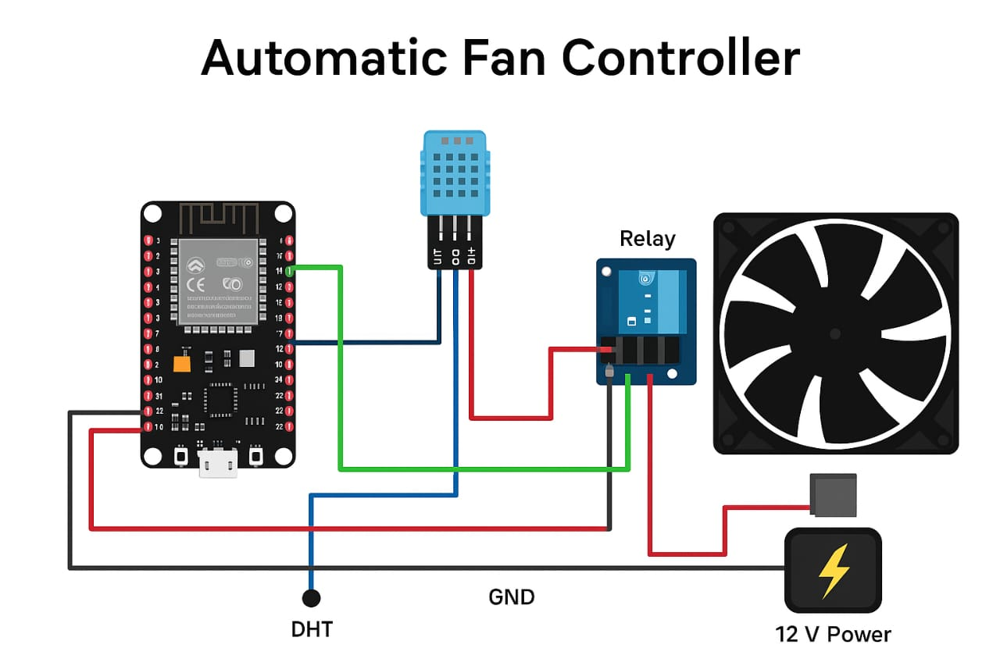

# Automatic Fan Control System

## Description

This project automatically controls a fan based on temperature using ESP32 and DHT11 sensor.

## Components Used

* ESP32
* DHT11 Temperature Sensor
* Relay Module
* Fan
* Jumper wires

## Working Principle

The DHT11 sensor measures temperature. If temperature exceeds a threshold (28°C), the relay turns ON the fan. Otherwise, the fan remains OFF.

## Technologies Used

* Embedded C
* Arduino IDE

## Applications

* Smart home automation.
* Temperature-based cooling systems.

## Future Improvements

* Integration with IoT for remote monitoring and control.
* Use of PWM for variable fan speed control.
* Implementation of hysteresis to avoid frequent switching.

## Block Diagram

This diagram shows the connection between ESP32, DHT11 sensor, relay module, and fan.

## Output / Result

* Fan turns ON when temperature exceeds 28°C.
* Fan turns OFF when temperature decreases.
